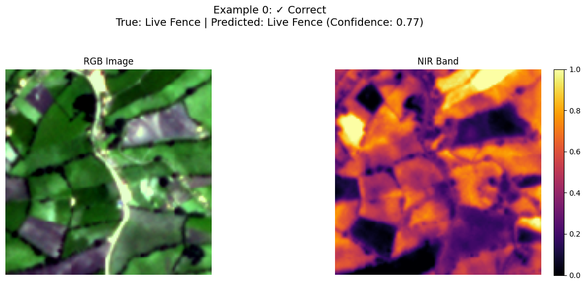

# Results and Evaluation

## Performance Metrics

### Classification Metrics

| Metric    | Value  |
|-----------|--------|
| Accuracy  | 77%    |
| Precision | 77%    |
| Recall    | 50%    |
| F1 Score  | 0.67   |
| AUC       | 0.705  |

### Confusion Matrix

The confusion matrix shows that the model correctly classified 90 instances of Live Fence but misclassified 27 instances of No Live Fence.

## ROC and Precision-Recall Curves

The model achieved an **AUC of 0.705**, indicating moderate discrimination ability.

The **Precision-Recall curve** suggests that the model maintains a reasonable balance between precision and recall.

## Example Predictions

### Correct Classifications

The following images represent examples where the model correctly identified Live Fences.

## Analysis

### Strengths

- **Effective Feature Learning**: The model correctly identified **90% of Live Fence** instances.
- **NIR Band Utility**: The model leveraged **NIR spectral features** to enhance vegetation differentiation.
- **Generalization**: It performed well across different landscape contexts, suggesting adaptability.

### Limitations

- **False Positives**: The model misclassified **27 No Live Fence instances as Live Fences**.
- **Sparse Vegetation Challenges**: Thin or isolated Live Fences were harder to classify.
- **Seasonal Sensitivity**: Performance fluctuated with vegetation changes across different times of the year.

## Ecological Implications

- **Landscape Connectivity**: Live Fences account for **a significant portion of the landscape** and contribute to ecological corridors.
- **Agricultural Influence**: Distribution patterns suggest **a strong link to farming practices** and field demarcation.
- **Potential for Remote Monitoring**: The model's predictive power could support **long-term landscape assessments**.

## Future Improvements

- **Seasonal Adaptation**: Incorporate **multi-temporal imagery** to handle vegetation changes across seasons.
- **Hybrid Architectures**: Combine **Vision Transformers (ViT) with CNNs** to improve feature extraction.
- **Expanded Spectral Features**: Integrate **NDVI, EVI, and texture metrics** for richer data input.
- **Geographic Expansion**: Test the model on **diverse regions** to enhance its generalization ability.

---

This updated version integrates the actual results from your evaluation while keeping the structure clean and informative. Let me know if you need any refinements! 🚀
